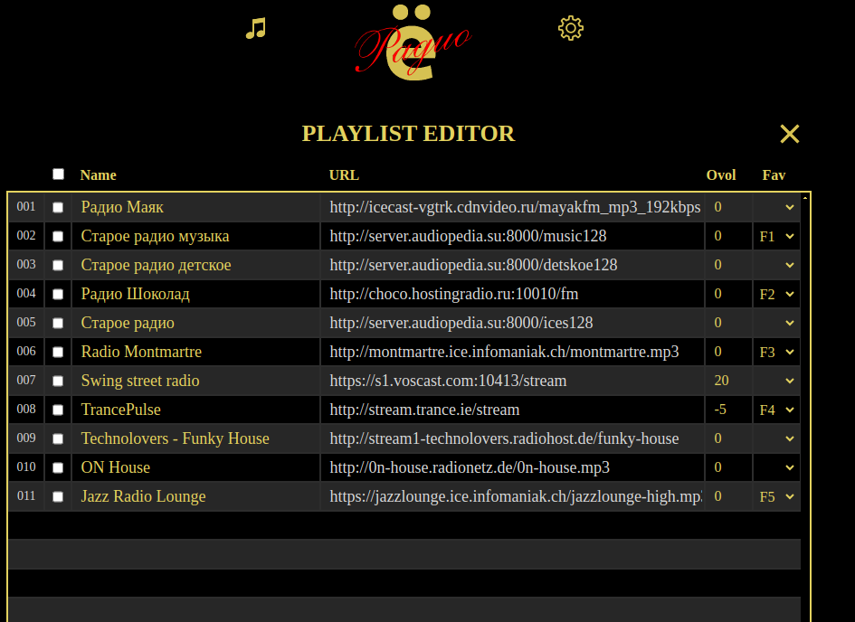

# [ёRadio](https://github.com/e2002/yoradio) mod based on version [0.9.434](https://github.com/e2002/yoradio/releases/tag/v0.9.434)
## Made on WROVER with 4MB spram + PCM5102 + ILI9341 + WROOM. Arduino IDE 1.8.19 + libraries as stock
### Now supports only ILI9341 and ST7735 (144GREENTAB) screens but last without batteries. 
I don't have any other displays.

### Need update SPIFFS. Need replase Adafruit_GFX_Library glcdfont.c with /fonts/glcdfont_mod.c

### All stock functions plus additionally:

- [Bluetooth source](#bluetooth-source)
- [Bluetooth sink](#bluetooth-sink)
- [AVRCP Controls](#avrcp-controls)
- [Favorite buttons](#favorite-buttons)
- [QR code button](#qr-code-button)
- [Battery charge indicator](#Battery-charge-indicator)
- [Connections](#connections)
- [Version history](#version-history)

---

## Bluetooth source
The Bluetooth transmitter based on an additional **ESP32-WROOM** module. It is connected via **I2s** in parallel to the **DAC**. Communication with the main module on the **ESP32-Wrover** via **uart** plus one pin is used to **mute** the main **DAC** when a Bluetooth speaker connected. Bluetooth devices are remembered in memory and the next time the connects automatically. A special block has been added on the settings page to control devices. 

It is possible to "forget" some speaker. 

When external bt speaker connected, the main **DAC** goes silent and bt icon appears on the screen.When the speaker disconnected, the sound continues from the main **DAC**. 
On the **PCM5102** board, you need to remove the H3L jumper so that the mute works from pin 3 (xsmt)

## Bluetooth sink
The Bluetooth receiver is built on the same module as the transmitter. You can enable synk mode in **Settings** -> **Bluetooth** -> **Enable bluetoots sink mode**.  You can also set the name of device there.
 
Switching modes is possible both via the web and the encoder. 

If the player supports metadata, it will be transmitted to the screen. 

[source code and binaries](https://github.com/jmper-ha/bt_source)

## AVRCP Controls
It is possible controls devices by **AVRCP** protocol in both source and sink modes.The following commands are available:
- play / pause
- forward / backward
- volume control

## Favorite buttons
Quick selection buttons allow you to select your favorite stations with one click. It's possible write a station on a button by long long pressing. If the station saved successfully, a short beep will sound. A buzzer is connected for this. If a station is already recorded, a warning will appear on the screen. You can define from 1 to 6 favorite buttons. Manage buttons possible from the playlist editor. 

The correspondence between buttons and stations is stored in the playlist, so it differs in format from the stock, one more field has been added. But the stock format is recognized without problems.

## QR code button
When you press the QR code button, a QR code is displayed on the screen to connect to the device via the phone camera. QR codes are different, depending on the state of the device. In the access point mode, the QR code allows you to connect your phone to wifi yoradio, if the device is connected to the Internet, the QR code leads to the main page, if there is no Internet connection yet, then to the wifi settings page.

## Battery charge indicator
Battery status/charge indication is also bsed on the additional **ESP32-WROOM** module. A voltage divider from the battery is connected pin 32. The charge LED from the battery controller is connected via an optocoupler. Also, one pin of the **WROOM** determines the method for detecting the charge status. At a low level, the state is read from the optocoupler, at a high level it is calculated mathematically (it works poorly so far).

[source code and binaries](https://github.com/jmper-ha/bt_source)

## Connections

## Version history

### v2
* Added Sink mode
* Added AVRCP controls in both modes
